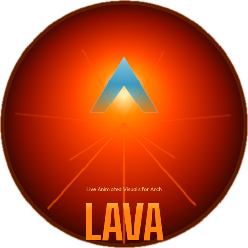

# LAVA - Live Animated Visuals for Arch

<p align="center">
  
</p>

<p align="center">
  <strong>A desktop live wallpaper engine for Arch Linux</strong><br>
  Inspired by KLWP (Android) — build interactive, animated wallpapers with formulas, data providers, and widgets.
</p>

---

## Features

- **8 layer types** — text, shape, image, progress bar, font icon, music visualizer, stack, overlap
- **Formula engine** — embed live data in any property: `$df(HH:mm)$`, `$mi(artist)$`, `$bi(level)$`
- **10 data providers** — date/time, battery, music (MPRIS), system info, CPU/RAM, network, traffic, weather, Hyprland workspaces, AI image generation
- **8 animation types** with 6 triggers — fade, rotate, scale, translate, color, blur, jiggle, flash
- **Interactive wallpaper** — click actions, scroll gestures (volume/brightness), hover animations
- **21 pre-built widgets** — clocks, weather, music players, system monitors, full themes
- **Wayland native** — renders as a true wallpaper layer via `gtk-layer-shell` on Hyprland

## Screenshots

*Coming soon*

---

## Installation

### Dependencies

**Required:**

```
gtk3  webkit2gtk-4.1  gtk-layer-shell  wireplumber
```

**Optional:**

```
brightnessctl    # brightness scroll gestures
hyprland         # primary compositor (Wayland)
sway             # basic compositor support
```

**Build tools:**

```
rust  cargo  nodejs  pnpm  pkg-config
```

### Install from source

```bash
git clone https://github.com/andason/lava.git
cd lava
./install.sh
```

Or manually:

```bash
pnpm install
cargo build -p lava-wallpaper --release
npx tauri build --bundles none
sudo install -Dm755 target/release/lava /usr/local/bin/lava
sudo install -Dm755 target/release/lava-wallpaper /usr/local/bin/lava-wallpaper
```

### Arch Linux (AUR)

```bash
# Using an AUR helper
yay -S lava
```

### Run

```bash
lava
```

---

## Quick Start

1. **Launch LAVA** — the editor opens with a blank project
2. **Add a widget** — click the `+` button in the toolbar, go to the **Widgets** tab, and click a preset (try "Minimal Clock")
3. **Edit properties** — select a layer in the left panel, adjust properties on the right (position, color, font, formulas)
4. **Apply as wallpaper** — click the wallpaper button (picture frame icon) in the toolbar
5. **Save your theme** — click **Save** to export as `.lava` file
6. **Or Use a basic theme in the + icon to help get you started** — click **+** go to widgets and then themes choose desktop dashboard or centered focus.  

---

## Editor Overview

### Toolbar

| Button | Action |
|--------|--------|
| **+** | Add layers, widgets, or full themes |
| Copy / Paste | Duplicate selected layer |
| Undo / Redo | History (Ctrl+Z / Ctrl+Y) |
| Interactive | Toggle live formula/animation preview in editor |
| Debug | Show layer bounds overlay |
| Wallpaper | Start/stop live wallpaper mode |
| Import | Load `.rock` or `.komp` components |
| Save / Open / New | Project file management |

### Left Panel Tabs

| Tab | Purpose |
|-----|---------|
| **Layers** | Layer tree with drag-and-drop reordering, visibility/lock toggles, rename, right-click export |
| **Globals** | Create and edit global variables (text, number, color, switch, list) |
| **Shortcuts** | Define keyboard shortcuts with actions |
| **BG** | Background color/image, resolution presets (1080p, 1440p, 4K) |
| **Settings** | App configuration (providers, weather, wallpaper behavior) |

### Property Panel (Right Side)

Select any layer to edit its properties:

- **Transform** — position, size, rotation, opacity, scale, anchor point, visibility formula
- **Actions** — click action, scroll action
- **Type-specific** — text content/font/color, shape fill/stroke/skew, image source/scale mode, etc.
- **Shadow** — color, offset, blur radius (text, shapes, images)
- **Animations** — add/remove with visual FX Builder

### Keyboard Shortcuts

| Shortcut | Action |
|----------|--------|
| `Ctrl+C` | Copy selected layer |
| `Ctrl+V` | Paste layer |
| `Ctrl+Z` | Undo |
| `Ctrl+Y` | Redo |
| `Delete` | Delete selected layer |
| `Escape` | Exit wallpaper preview |
| `Super+Escape` | Exit wallpaper (global, works from any app) |

---

## Layer Types

### Text

Renders formatted text with formula support.

```
Properties: text, fontSize, fontFamily, color, textAlign, maxLines, lineSpacing, shadow
```

The text field accepts formulas: set it to `$df(HH:mm)$` to display the current time, or `$mi(title)$ - $mi(artist)$` for the current song.

### Shape

Rectangle, circle, oval, triangle, or arc with fill, stroke, and perspective transforms.

```
Properties: shapeKind, fill, stroke, strokeWidth, cornerRadius, skewX, skewY, shadow
```

Set fill to `transparent` or `none` for stroke-only shapes. Use skewX/skewY for perspective effects.

### Image

Displays local files, URLs, or formula-driven sources.

```
Properties: src, scaleMode (fit/fill/crop/stretch), cornerRadius, tint, shadow
```

The `src` field accepts file paths, URLs, or formulas like `$mi(cover)$` for album art.

### Progress

Arc, bar, or circle progress indicators driven by formulas.

```
Properties: style, min, max, value, color, trackColor, strokeWidth
```

Example: set value to `$bi(level)$` for a battery meter, or `$mu(div, rm(cpuuse), 1)$` for CPU usage.

### Font Icon

Material Icons or Font Awesome glyphs, or custom SVG/PNG icons.

```
Properties: iconSet, glyphCode, color, fontSize, iconSrc
```

Use the built-in icon picker to browse thousands of icons, or search Iconify for more.

### Visualizer

Real-time audio visualizer that captures system audio via PipeWire.

```
Properties: vizStyle (bars/wave), barCount (4-64), barSpacing, sensitivity, colorTop, colorMid, colorBottom, peakColor
```

### Stack

Arranges child layers horizontally or vertically with spacing.

```
Properties: orientation, spacing
```

### Overlap

Free-form container where children are positioned independently by their x/y coordinates.

---

## Formulas

Formulas use `$...$` delimiters and can be placed in any text or numeric property. Inside a formula, nested function calls don't need extra `$` delimiters.

### Date & Time

```
$df(HH:mm)$              → "14:05"
$df(EEEE, MMMM d)$       → "Wednesday, March 12"
$df(hh:mm a)$             → "02:05 PM"
$dp(h)$                   → 14 (hour as number)
$tu(s)$                   → 1710273600 (unix timestamp)
```

**Format codes:** `HH` (24h), `hh` (12h), `mm`, `ss`, `a`/`A` (am/pm), `d`/`dd`, `M`/`MM`/`MMM`/`MMMM`, `EEEE`/`EEE` (weekday), `yyyy`/`yy`, `DDD` (day of year), `w` (week)

### Math — `$mu(function, args...)$`

```
$mu(round, 3.7)$          → 4
$mu(round, 3.14159, 2)$   → 3.14
$mu(ceil, rm(cpuuse))$    → CPU % rounded up
$mu(rnd, 1, 100)$         → random number 1-100
$mu(add, 5, 3)$           → 8
$mu(pow, 2, 10)$          → 1024
$mu(sqrt, 144)$           → 12
$mu(min, 50, bi(level))$  → smaller of 50 or battery
```

**Functions:** `ceil`, `floor`, `round`, `abs`, `sin`, `cos`, `tan`, `asin`, `acos`, `atan`, `log`, `ln`, `pow`, `sqrt`, `min`, `max`, `rnd`, `add`, `sub`, `mul`, `div`, `mod`, `h2d`, `d2h`

### Text — `$tc(function, args...)$`

```
$tc(low, "HELLO")$        → "hello"
$tc(up, "hello")$         → "HELLO"
$tc(cap, "hello world")$  → "Hello World"
$tc(cut, "abcdef", 0, 3)$ → "abc"
$tc(ell, mi(title), 20)$  → "Long Song Titl..." (max 20 chars)
$tc(len, "hello")$        → 5
$tc(reg, "abc123", "[0-9]", "")$ → "abc"
$tc(n2w, 42)$             → "forty two"
$tc(ord, 3)$              → "3rd"
$tc(roman, 2024)$         → "MMXXIV"
$tc(json, gv(data), "results.0.name")$ → JSON path extraction
```

**Functions:** `low`, `up`, `cap`, `cut`, `ell`, `split`, `len`, `count`, `lines`, `reg`, `n2w`, `ord`, `utf`, `roman`, `url`, `html`, `json`

### Logic

```
$if(bi(level)<20, LOW, OK)$
$if(mi(state)=PLAYING, ▶, ⏸)$
$if(bi(plugged)=1, Charging, bi(level)%)$
```

For loops:
```
$fl(1, 5, 1, ★, )$       → "★★★★★"
```

### Color — `$ce(color, filter, amount)$`

```
$ce(#ff0000, alpha, 50)$      → 50% transparent red
$ce(#ff0000, sat, 50)$        → desaturated red
$ce(#ff0000, lum, 80)$        → lighter red
$ce(#ff0000, comp)$            → complementary color
$ce(#ff0000, invert)$          → inverted
$cm(200, 80, 50)$              → create from HSL
```

### Variables

```
$gv(myVar)$               → value of global variable "myVar"
```

Global variables can contain formulas themselves — they're evaluated recursively.

### Web Fetch — `$wg(url, type, path)$`

```
$wg("https://api.example.com/data", json, "results.0.name")$
$wg("https://example.com/feed.xml", rss, "title", 0)$
$wg("https://example.com/page", txt, "", 0)$   → first line
```

Results are cached with a configurable TTL (default 300 seconds).

### Lyrics — `$lrc(text, position)$`

```
$lrc(gv(ly_raw), mi(pos))$              → current lyric line
$lrc(gv(ly_raw), mi(pos), 1)$           → next line
$lrc(gv(ly_raw), mi(pos), -1)$          → previous line
```

---

## Data Providers

Access live system data in any formula using `$prefix(key)$`.

### Date/Time (`dt`) — 1s refresh

| Key | Value |
|-----|-------|
| `epoch` | Unix timestamp |
| `h`, `hh`, `H`, `HH` | Hour (12h/24h, with/without padding) |
| `m`, `mm`, `s`, `ss` | Minute, second |
| `a`, `A` | am/pm, AM/PM |
| `d`, `dd`, `M`, `MM` | Day, month |
| `EEEE`, `EEE` | Weekday name (full/abbreviated) |

### Battery (`bi`) — 10s refresh

| Key | Value |
|-----|-------|
| `level` | 0–100 |
| `status` | CHARGING, DISCHARGING, FULL |
| `plugged` | 0 or 1 |

### Music (`mi`) — 1s refresh (via MPRIS/playerctl)

| Key | Value |
|-----|-------|
| `title`, `artist`, `album` | Track metadata |
| `state` | PLAYING, PAUSED, STOPPED |
| `pos`, `len` | Position/length in seconds |
| `percent` | Playback progress 0–100 |
| `cover` | Album art URL |
| `package` | Player name (e.g., spotify) |

### System Info (`si`) — 5s refresh

| Key | Value |
|-----|-------|
| `model` | Hostname |
| `man` | Linux distribution |
| `build` | Kernel version |
| `boot` | Uptime (formatted) |
| `uptime` | Uptime (seconds) |

### Resources (`rm`) — 2s refresh

| Key | Value |
|-----|-------|
| `cpuuse` | CPU usage % |
| `memtot`, `memfree`, `memuse` | Memory (bytes) |
| `ramp` | RAM usage % |
| `sdtot`, `sdfree` | Disk space (bytes) |

### Network (`nc`) — 5s refresh

| Key | Value |
|-----|-------|
| `connected` | 0 or 1 |
| `name`, `ssid` | Connection/WiFi name |
| `strength` | Signal strength |
| `ip` | IP address |

### Traffic (`ts`) — 2s refresh

| Key | Value |
|-----|-------|
| `srx`, `stx` | Download/upload speed (bytes/s) |
| `trx`, `ttx` | Total received/transmitted (bytes) |

### Weather (`wi`) — configurable refresh

| Key | Value |
|-----|-------|
| `temp`, `tempc`, `flik` | Temperature, feels-like |
| `hum`, `press` | Humidity, pressure |
| `cond`, `icon` | Condition text, icon code |
| `wspeed`, `wdir`, `wgust` | Wind |

Requires an API key in Settings. Supports OpenWeatherMap.

### Hyprland (`hy`) — event-driven

| Key | Value |
|-----|-------|
| `workspace` | Active workspace number |
| `ws_N_exists`, `ws_N_active`, `ws_N_windows` | Per-workspace state (N = 1-10) |
| `focused_app`, `focused_title` | Active window |
| `app_count` | Total open windows |
| `gpu` | GPU utilization % |

### AI Image (`ai`) — 5s refresh

| Key | Value |
|-----|-------|
| `artistImage` | File path to generated image |
| `status` | idle, generating, ready, error, no api key, no music |

Generates AI art via Google Gemini based on the current music artist. Requires a Gemini API key at `~/.config/lava/gemini_api_key`. Customize the prompt via the `ai_prompt` global variable.

---

## Animations

Add animations to any layer via the **Animations** section in the Property Panel, or use the visual **FX Builder**.

### Types

| Type | Effect |
|------|--------|
| **Fade** | Animate opacity |
| **Rotate** | Spin (degrees) |
| **Scale** | Grow/shrink |
| **Translate** | Move (pixels) |
| **Color** | Tint overlay |
| **Blur** | Gaussian blur |
| **Jiggle** | Oscillating rotation |
| **Flash** | Bright pulse on trigger |

### Triggers

| Trigger | When it fires |
|---------|--------------|
| **Time** | Continuous loop based on speed |
| **Scroll** | User scrolls (amount maps to scroll delta) |
| **Reactive** | Driven by a formula rule value |
| **Tap** | On click/tap |
| **Show** | When layer becomes visible |
| **Hover** | On mouse hover |

### Properties

- **Amount** — intensity (degrees for rotate, pixels for translate, 0-255 for fade/color)
- **Speed** — duration in milliseconds
- **Delay** — wait before starting (ms)
- **Easing** — linear, ease-in, ease-out, ease-in-out, bounce, elastic
- **Loop** — none, restart, reverse

---

## Click & Scroll Actions

Assign actions to any layer's **Click Action** or **Scroll Action** property. Actions propagate up the layer tree — a child without an action inherits its parent's.

### Click Actions

| Action | Example | Effect |
|--------|---------|--------|
| `music:play-pause` | | Toggle playback |
| `music:next` | | Next track |
| `music:previous` | | Previous track |
| `app:command` | `app:firefox` | Launch application |
| `url:address` | `url:https://google.com` | Open in browser |
| `overlay:name` | `overlay:settings_panel` | Toggle layer visibility |
| `set:var:value` | `set:theme:dark` | Set global variable |
| `editor:show` | | Bring editor to front |

### Scroll Actions

| Action | Effect |
|--------|--------|
| `volume:adjust` | Adjust system volume (PipeWire/WirePlumber) |
| `brightness:adjust` | Adjust screen brightness (brightnessctl) |

Both show an on-screen display (OSD) with the current level.

---

## Wallpaper Mode

Click the wallpaper button in the toolbar to apply your theme as a live desktop wallpaper.

### How it works

LAVA spawns a separate `lava-wallpaper` process that creates a Wayland layer-shell surface at the bottom layer, covering your entire screen behind all windows. The wallpaper renders the same Svelte canvas with full formula evaluation, animations, and interactivity.

### Features

- **Fade on focus** — wallpaper dims when app windows are focused (configurable opacity in Settings)
- **Auto-start** — enable in Settings to automatically apply the last wallpaper on login
- **System tray** — start/stop wallpaper, show editor, or quit from the tray icon
- **Exit** — press `Super+Escape` from anywhere, or `Escape` in the editor preview

### Compositor Support

| Compositor | Status |
|------------|--------|
| **Hyprland** | Full support (workspace tracking, window focus detection, fade-on-focus) |
| **Sway** | Basic support (wallpaper rendering) |
| **X11** | Not supported |

---

## File Formats

| Extension | Type | Description |
|-----------|------|-------------|
| `.lava` | Theme | Full project (layers, globals, shortcuts, settings) |
| `.rock` | Component | Single layer tree with bundled globals |


---

## Settings

Access via the **Settings** tab (gear icon) in the left panel.

| Setting | Default | Description |
|---------|---------|-------------|
| Close to tray | On | Minimize to tray instead of quitting |
| Start minimized | Off | Launch hidden (tray only) |
| Auto-start wallpaper | Off | Apply last wallpaper on launch + add to system autostart |
| Fade on focus | On | Dim wallpaper when windows are focused |
| Fade opacity | 30% | How much to dim (0% = invisible, 100% = no fade) |
| Formula refresh | 1000ms | How often formulas re-evaluate |
| Provider intervals | Varies | Per-provider polling frequency |
| Weather source | OpenWeatherMap | Weather API provider |
| Weather API key | — | Your API key for weather data |
| Weather location | — | City name or `lat,lon` |
| Web cache TTL | 300s | How long `$wg()$` results are cached |

---

## Configuration

Config files are stored at `~/.config/lava/`:

```
~/.config/lava/
  settings.json      # App settings
  gemini_api_key     # Google Gemini API key (plain text, one line)
```

Cache and generated files at `~/.cache/lava/`:

```
~/.cache/lava/
  ai-images/         # Generated AI artist portraits
```

---

## Building from Source

```bash
# Clone
git clone https://github.com/andason/lava.git
cd lava

# Install dependencies
pnpm install

# Development mode (hot reload)
cargo build -p lava-wallpaper && pnpm tauri dev

# Release build
cargo build -p lava-wallpaper --release
npx tauri build --bundles none

# Binaries at:
#   target/release/lava
#   target/release/lava-wallpaper
```

### Tech Stack

- **Frontend**: Svelte 5, TypeScript, HTML Canvas
- **Backend**: Rust (Tauri v2)
- **Wallpaper**: GTK3 + WebKitGTK + gtk-layer-shell
- **Formula engine**: Custom Rust crate (`kustom-formula`)
- **Audio capture**: PipeWire via `parec` + FFT

---

## Acknowledgments

Inspired by [KLWP (Kustom Live Wallpaper)](https://play.google.com/store/apps/details?id=org.kustom.wallpaper) for Android by Frank Monza. LAVA is an independent project — not affiliated with Kustom Industries.

---

## License

MIT
